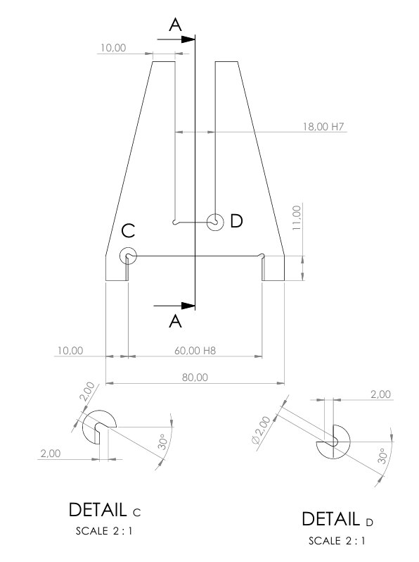
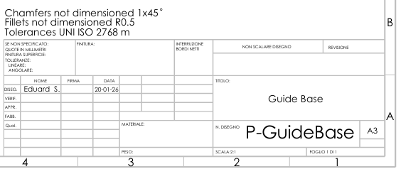
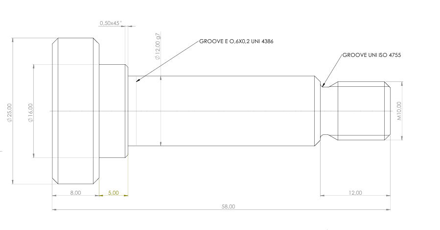
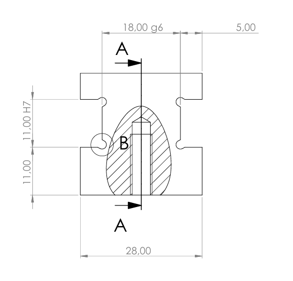

# 📄 Technical Drawings
_The following sheets illustrate the final functional dimensioning. All drawings comply with ISO 2768-m for general tolerances and include specific ISO fits (H7, g6, g7, H8) to ensure the correct kinematic behavior of the mechanism._
# 📥 Full Documentation
High-resolution PDF technical sheets are available in the [Drawings folder](PDF/).

---

---

---

