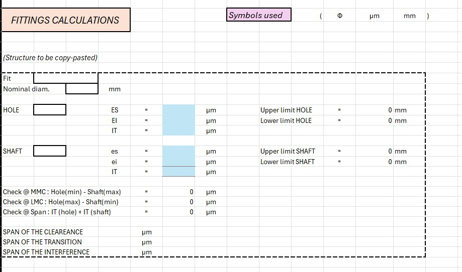

# Eccentric Mechanism Design

This project focuses on the design and **functional dimensioning** of an eccentric mechanism, developed as a technical exercise based on the textbook *"Quotatura funzionale degli organi di macchine"*.

## Project Overview

The objective of this mechanism is to transform **rotary motion** into **reciprocating linear motion**. It serves as a practical application of mechanical tolerances and kinematic chain analysis.

### Kinematics & Animation
The following GIF illustrates the transformation of motion:

---

## How it Works

The mechanical assembly consists of three main functional stages:

1.  **Input Shaft:** The drive shaft provides the initial constant rotary motion.
2.  **Bushing & Eccentric Disc:** The motion is transmitted to the eccentric disc through a precision-fitted **bushing**. The offset (eccentricity) of the disc is the key parameter that determines the stroke of the output.
3.  **Slider:** The rotation of the eccentric element forces the slider into a **reciprocating linear motion** (back-and-forth).

## Technical Features

* **Functional Dimensioning:** Each component has been designed following a top-down approach, ensuring that tolerances and fits support the overall mechanical objective.
* **Materials & Fits:** Special attention was given to the contact surfaces between the shaft, bushing, and disc to minimize wear and ensure smooth operation. Implemented a check to MMC and LMC conditions to ensure assembly functionality.
* **Mechanical Standards:** Design references and symbols follow international technical drawing standards (ISO/UNI).

---

## Tools Used
* **CAD Software:** [Inserisci il nome del software, es. SolidWorks / Inventor / Fusion 360]
* **Microsoft Excel:** I developed a dedicated calculation tool to manage ISO deviations. The tool automatically verifies the assembly conditions at MMC and LMC, ensuring that the Minimum Clearance is always maintained above the functional threshold.

  
  ---
  
  ---
  
